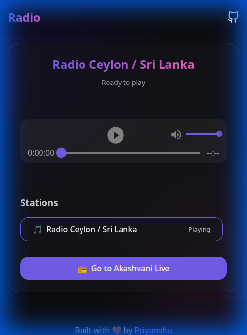

<div align="center">
  
  <h1>Online Radio Streamer</h1>
  <p>
    <strong>A modern, premium, and glassmorphic online radio player built for the web.</strong>
  </p>

  <p>
    <a href="https://radiostr.netlify.app">View Demo</a> •
    <a href="https://github.com/priyanshujoshi99/online-radio-streamer/issues">Report Bug</a> •
    <a href="https://github.com/priyanshujoshi99/online-radio-streamer/pulls">Request Feature</a>
  </p>

  [](https://radiostr.netlify.app)
  [](https://opensource.org/licenses/MIT)
  [](https://react.dev/)
  [](https://vitejs.dev/)
  [](https://www.typescriptlang.org/)
</div>

<br />

## 🌟 Overview

**Online Radio Streamer** is a sophisticated web application designed to bring the radio experience to your browser. Featuring a stunning **Glassmorphism** UI, it provides a seamless listening experience for stations like **Radio Ceylon / Sri Lanka** and **Akashvani Live**.

Built with modern web technologies, it ensures performance, accessibility, and a native-app feel via PWA support.

<div align="center">
  
</div>

## ✨ Features

- **🎨 Premium Design**: A beautiful Glassmorphism interface with dark mode aesthetics.
- **📻 Live Streaming**: Robust audio playback for HTTP/HTTPS radio streams.
- **📱 Fully Responsive**: Optimized layout for desktop, tablet, and mobile.
- **🌍 Akashvani Integration**: Dedicated proxy handling to stream Akashvani Live securely.
- **⚡ PWA Ready**: Installable on your device with offline app shell support.
- **🛡️ Secure**: Strict content security policies and safe proxying.

## 🛠️ Tech Stack

- **Core**: React 19, TypeScript 5, Vite 7
- **Styling**: CSS Modules, CSS Custom Properties (Variables)
- **Audio**: `react-h5-audio-player`
- **Deployment**: Netlify (Edge Functions used for stream proxying)

## 🚀 Getting Started

### Prerequisites

- Node.js (v18 or higher)
- npm or yarn

### Installation

1. **Clone the repository**
   ```bash
   git clone https://github.com/priyanshujoshi99/online-radio-streamer.git
   cd online-radio-streamer
   ```

2. **Install dependencies**
   ```bash
   npm install
   ```

3. **Configure Environment**
   Create a `.env` file in the root directory (or modify the existing one):
   ```bash
   VITE_RADIO_PRIMARY_NAME="Radio Sri Lanka"
   VITE_RADIO_PRIMARY_URL="http://220.247.227.20:8000/RSLstream"
   VITE_AKASHVANI_URL="/radio/live.php"
   VITE_AKASHVANI_PROXY_TARGET="https://akashvani.gov.in/radio"
   ```

4. **Run Development Server**
   ```bash
   npm run dev
   ```

## 📦 Deployment

This project comes with a `netlify.toml` pre-configured for **Netlify**.

1. **Push to GitHub**.
2. **Import site in Netlify**.
3. **Environment Variables**: Add the variables from your `.env` to Netlify Site Settings.
4. **Deploy**! The Edge Functions for proxying will be deployed automatically.

## 🤝 Contributing

Contributions are what make the open source community such an amazing place to learn, inspire, and create. Any contributions you make are **greatly appreciated**.

1. Fork the Project
2. Create your Feature Branch (`git checkout -b feature/AmazingFeature`)
3. Commit your Changes (`git commit -m 'Add some AmazingFeature'`)
4. Push to the Branch (`git push origin feature/AmazingFeature`)
5. Open a Pull Request

## 📝 License

Distributed under the MIT License. See `LICENSE` for more information.

## ❤️ Acknowledgements

Built with love by [Priyanshu](https://github.com/priyanshujoshi99).
